<!-- .slide: data-background="#002b36" -->

# Split-Ergo-Tastaturen

## Deine Handgelenke verdienen Besseres

Eine Reise von "Autsch" zu "Ahhh" in 12 Folien

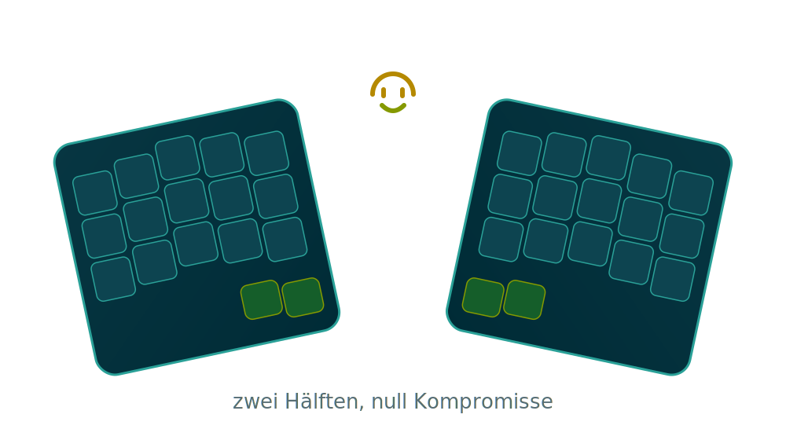

Note:
Willkommen! Auch wenn du keine Ahnung vom Thema hast: keine Sorge, die Folien
erzählen die Geschichte. Du musst sie nur vorlesen und so tun, als wärst du
Experte. Es geht um geteilte, ergonomische Tastaturen - warum sie existieren
und warum manche Menschen dafür ihre Freizeit opfern.

---

<!-- .slide: data-background="#002b36" -->

## Der Bösewicht 🦹

Gesucht

- Eine gerade Reihe, **schmaler** als deine Schultern
- Reihen **seitlich versetzt** (Erbe der Schreibmaschine)
- Zwingt Hände in unnatürliche Posen
- Steht in fast jedem Büro der Welt

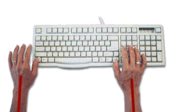

Verbrechen: Körperverletzung an Handgelenken seit ca. 1873.

Note:
Hier ist der Übeltäter: die ganz normale Tastatur. Das Layout stammt von
mechanischen Schreibmaschinen - der seitliche Versatz der Reihen war nötig,
damit sich die Typenhebel nicht verhaken. Diese Hebel gibt es längst nicht
mehr, den Versatz schleppen wir aber bis heute mit.

---

<!-- .slide: data-background="#002b36" -->

## Problem 1: Ulnarabduktion 🤕

- Tastatur ist **schmal**, Hände müssen **zusammen**
- Handgelenke knicken nach außen Richtung kleinem Finger
- Das nennt sich **ulnare Abduktion**
- Dauerhafter Druck auf Sehnen &amp; Nerven

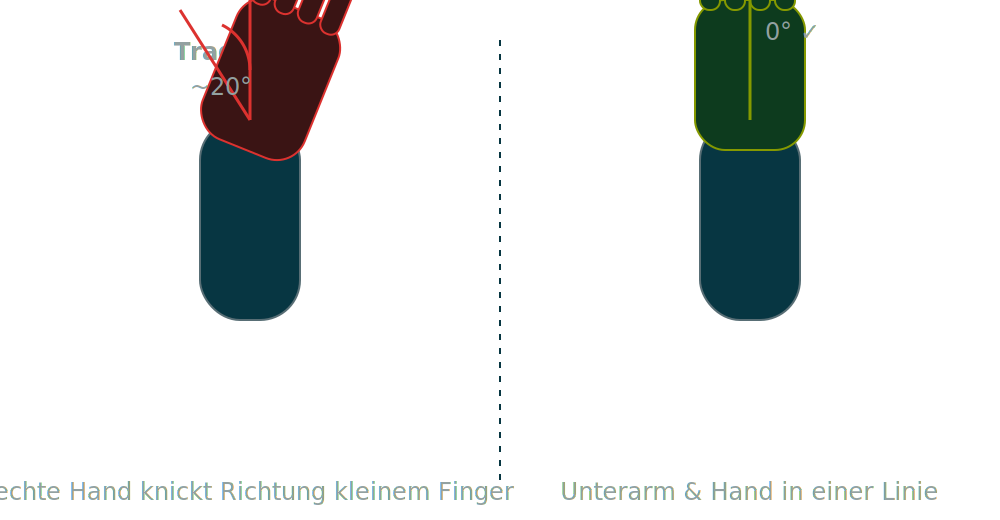

Note:
Erstes Problem: Weil die Tastatur schmaler ist als der Schulterabstand, ziehen
wir die Hände nach innen. Dabei knickt das Handgelenk seitlich ab - Richtung
kleiner Finger. Das heißt ulnare Abduktion (oder "ulnar deviation"). Über
Stunden gehalten, reizt das Sehnen und Nerven im Handgelenk.

---

<!-- .slide: data-background="#002b36" -->

## Problem 2: Schultern &amp; Unterarme 🙆

- Schmale Tastatur => Ellbogen **eingeklemmt**
- Schultern nach **innen** gerollt (Adduktion)
- Unterarme **proniert**: Handfläche zwangsweise nach unten
- Den ganzen Tag = müde Schultern &amp; Nacken

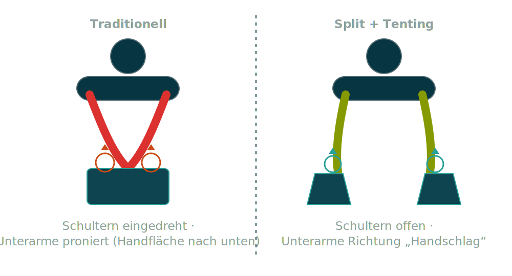

Note:
Zweites Problem liegt weiter oben. Eine schmale Tastatur zwingt die Ellbogen an
den Körper, die Schultern rollen nach innen. Gleichzeitig müssen wir die
Unterarme eindrehen, damit die Handflächen flach nach unten zeigen - das nennt
man Pronation. Neutral wäre eher die "Handschlag"-Position. Stunden in dieser
Verdrehung = verspannte Schultern und Nacken.

---

<!-- .slide: data-background="#002b36" -->

## Die Lösung: Splitten + Tenting ✨

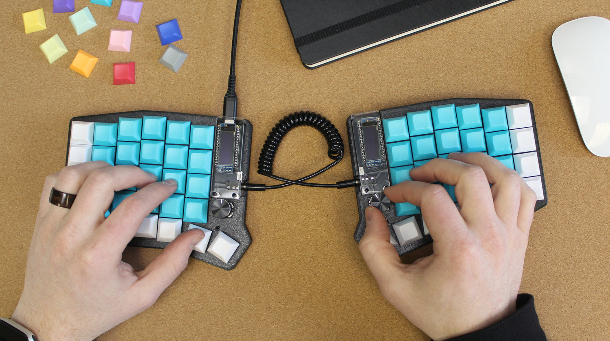

- Splitten: Arme auseinander, Schultern offen
- Tenting: Innenkanten anheben, keine Pronation
- Daumentasten: Starke Daumen entlasten kleinen Finger

==> Gerade Handgelenke, lockere Schultern

Note:
Die Lösung adressiert genau diese drei Punkte. Erstens: die Tastatur in zwei
Hälften teilen und schulterbreit auseinanderstellen - Schultern öffnen sich,
Handgelenke werden gerade. Zweitens: Tenting, also die Innenkanten anheben, wie
ein Zelt - damit verschwindet die Pronation. Drittens: starke Daumen für eigene
Tasten nutzen, statt alles dem schwachen kleinen Finger aufzubürden.

---

<!-- .slide: data-background="#002b36" -->

## Problem 3: Finger auf Wanderschaft 🥾

- Versetzte Reihen => Finger gehen im **Zickzack**
- Ständig die **Grundreihe verlassen**
- Lange Wege = mehr Arbeit pro Anschlag
- Der kleiner Finger macht den halben Job

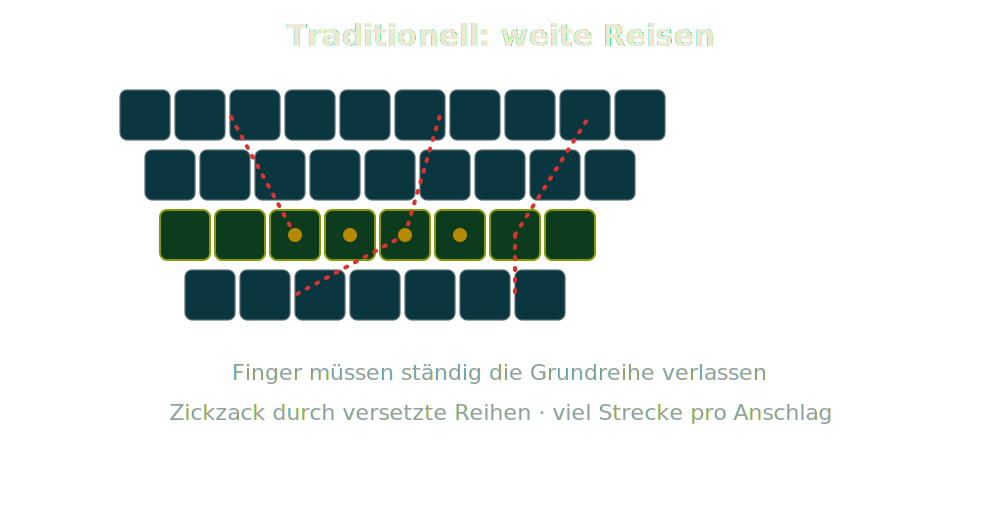

Note:
Drittes Problem: die Wege, die die Finger zurücklegen. Durch den seitlichen
Reihenversatz müssen Finger schräg über die Tastatur wandern und immer wieder
die Grundreihe verlassen. Viel Bewegung, viel Belastung: der kleine Finger
ist hoffnungslos überlastet und die Schultern müssen das Gewicht der 
Arme dabei tragen. 

---

<!-- .slide: data-background="#002b36" -->

## 34/36 Tasten: weniger ist mehr 🎯

- Nur **3×5** Tasten pro Hand + **Daumen**
- **Spalten** statt Reihen versetzt - folgt der Fingerlänge
- Finger bleiben quasi auf der **Grundreihe**
- "Aber wo sind die Zahlen?!" → nächste Folie

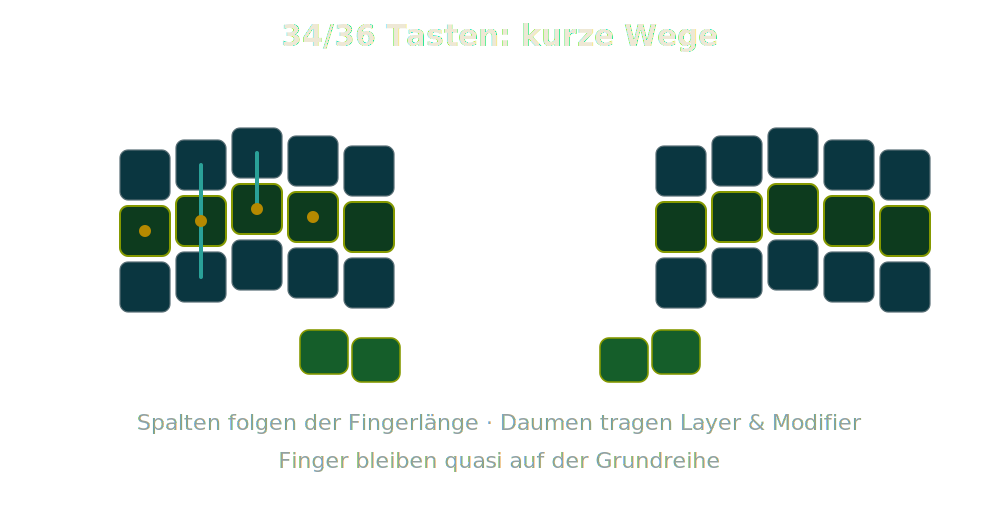

Note:
Der radikale Gegenentwurf: nur noch 34 oder 36 Tasten. Drei Reihen mal fünf
Spalten pro Hand, plus ein paar Daumentasten. Statt die Reihen seitlich zu
versetzen, versetzt man die Spalten vertikal - passend zur unterschiedlichen
Fingerlänge. Ergebnis: die Finger bleiben fast immer auf der Grundreihe. Die
logische Frage: Wo sind dann Zahlen, Klammern, F-Tasten? Das klärt die nächste
Folie.

---

<!-- .slide: data-background="#002b36" -->

## Die Magie der Layer 🪄

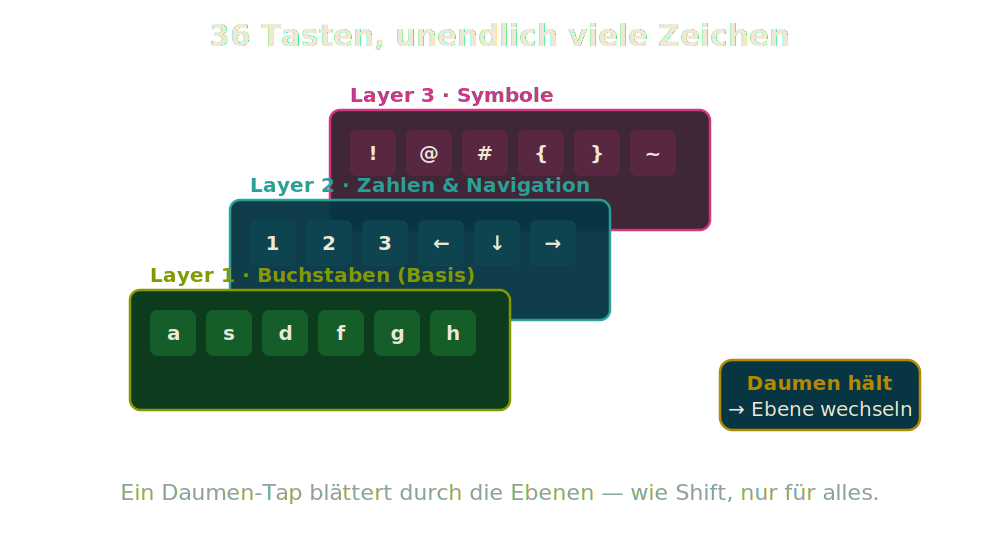

Note:
Die Antwort heißt Layer - Ebenen. Eine physische Taste kann viele Zeichen
bedeuten, je nachdem welche Ebene gerade aktiv ist. Genau wie Shift schon immer
ein zweites Layer war: Wir kennen das also längst. Ein Daumen hält eine
Ebenen-Taste, und plötzlich liegen Zahlen, Pfeile oder Symbole direkt unter den
Fingern - ganz ohne die Hand zu bewegen.

---

<!-- .slide: data-background="#002b36" -->

## Unter der Haube: die Lötmatrix 🔌

- Jede Taste einzeln verkabeln? **Pin-Apokalypse**
- Stattdessen: **Reihen × Spalten** als Gitter
- Controller scannt blitzschnell Zeile für Zeile
- Wenige Pins, viele Tasten

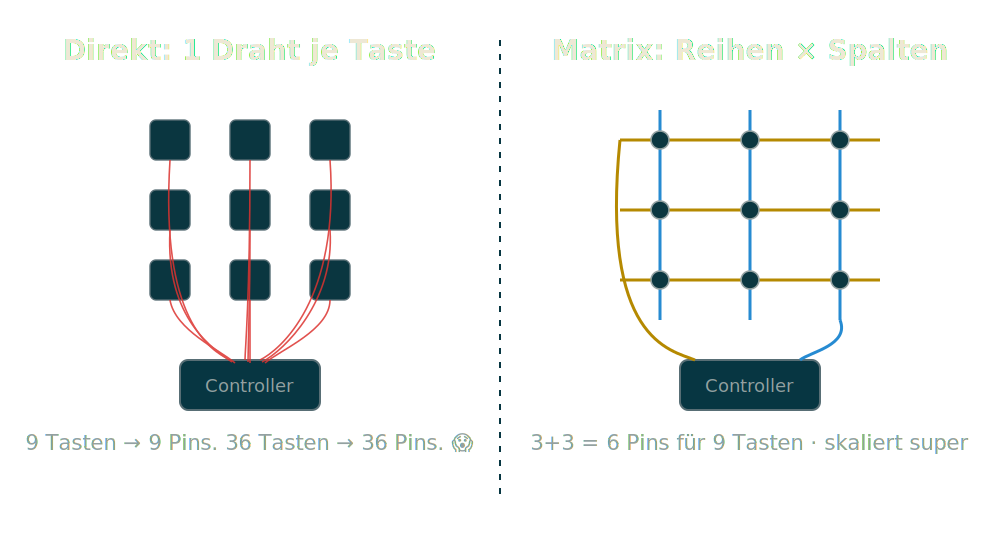

Note:
Jetzt ein Blick ins Innere, denn viele bauen diese Tastaturen selbst. Würde man
jede Taste mit einem eigenen Draht zum Controller führen, bräuchte man bei 36
Tasten 36 Pins; bei großen Boards wird das unmöglich. Trick: die Tasten in einem
Gitter aus Reihen und Spalten verdrahten. Der Controller legt nacheinander
Spannung auf jede Reihe und liest die Spalten aus. So reichen z. B. Reihen plus
Spalten statt einem Pin pro Taste.

---

<!-- .slide: data-background="#002b36" -->

## Matrix-Trick: Dioden ⚡

- Mehrere Tasten gleichzeitig => **Phantom-Anschläge** (Ghosting)
- Strom nimmt "Abkürzungen" durchs Gitter
- **Eine Diode pro Taste** = Einbahnstraße
- Ergebnis: **N-Key-Rollover**, jeder Anschlag zählt

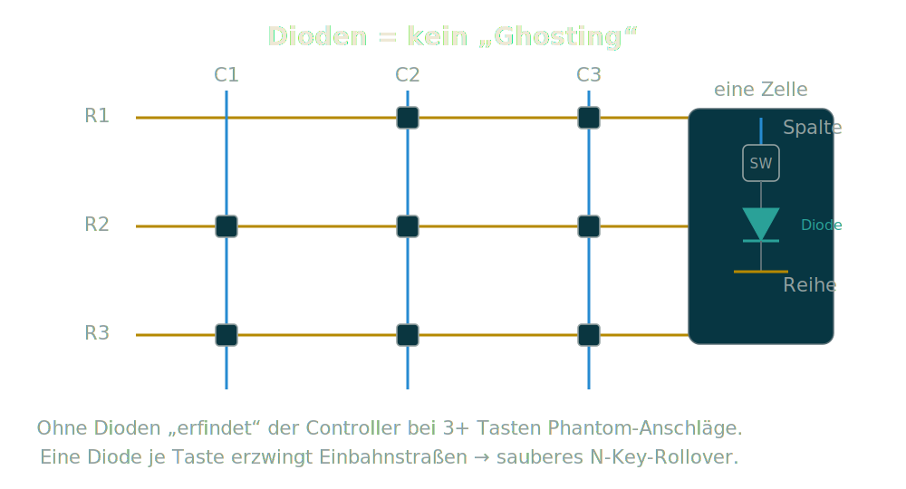

Note:
Ein Gitter hat aber eine Tücke: Drückt man mehrere Tasten gleichzeitig, kann der
Strom unerwartete Wege durchs Gitter nehmen und der Controller "sieht" eine
vierte, nie gedrückte Taste - das nennt man Ghosting. Die Lösung sind Dioden:
ein winziges Bauteil pro Taste, das Strom nur in eine Richtung lässt. Damit kann
man beliebig viele Tasten gleichzeitig drücken - das ist N-Key-Rollover. Genau
diese Dioden lötet man beim Selbstbau Stück für Stück ein.

---

<!-- .slide: data-background="#002b36" -->

## Mechanische Switches 101 🔧

- **Linear**: gleichmäßig, leise - Gamer-Liebling
- **Taktil**: spürbarer Höcker am Auslösepunkt
- **Clicky**: Höcker **+** hörbarer Klick 🔊
- Kraft &amp; Weg unterscheiden das Gefühl

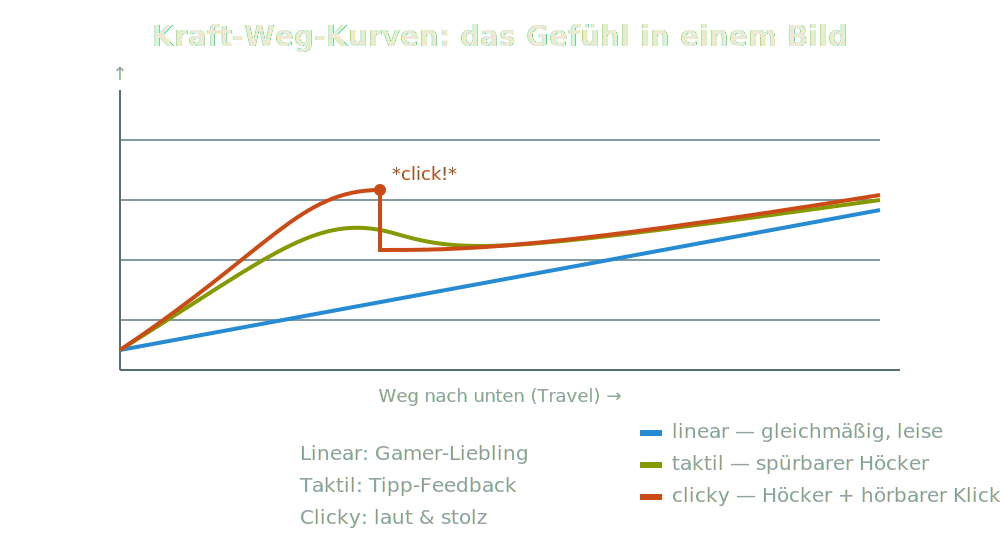

👉 Schnapp dir einen losen Switch und drück mal!

Note:
Jetzt der haptische Teil. Mechanische Switches gibt es grob in drei Charakteren.
Linear: der Widerstand steigt gleichmäßig, kein Feedback, sehr leise - beliebt
beim Gaming. Taktil: ein spürbarer kleiner Höcker sagt dir "jetzt hat's
ausgelöst". Clicky: derselbe Höcker, aber mit einem lauten, stolzen Klick. Die
Kurven rechts zeigen das. Und jetzt der Mitmach-Moment: Ich habe lose Switches
und Tastaturen dabei - gebt sie rum und fühlt den Unterschied selbst.

---

<!-- .slide: data-background="#002b36" -->

## Fazit: Probier's aus! 🚀

- Gerade Handgelenke, offene Schultern, kurze Wege
- Weniger Tasten dank cleverer **Layer**
- Drunter: **Matrix + Dioden**, oft selbst gelötet
- Switches = Geschmackssache zum **Anfassen**

### Danke! Jetzt drückt die Tasten 👏

Note:
Zusammengefasst: Split-Ergo-Tastaturen lösen drei echte Probleme - abgeknickte
Handgelenke, eingedrehte Schultern und lange Fingerwege. Weniger Tasten sind
dank Layern kein Verlust, sondern Komfort. Darunter steckt eine simple, oft
selbstgebaute Matrix mit Dioden. Und welcher Switch der richtige ist, entscheidet
allein dein Geschmack. Also: nehmt die losen Switches, drückt drauf, und sagt
mir, welcher euch am besten gefällt. Danke!
